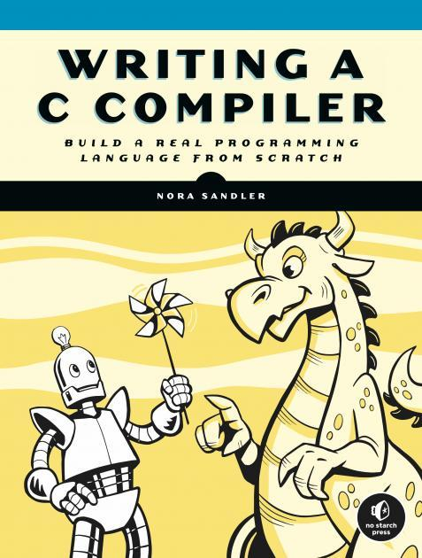

Writing a C Compiler
=

In this project I'm "writing a C compiler", guided by the [book](https://norasandler.com/book/) of
that name by Nora Sandler. It's a great book, and I highly recommend it.

A big part of what I like about this book is what _isn't_ in it.
Although she does provide numerous pseudo-code examples, and even 
a reference version of the compiler, [online](https://github.com/nlsandler/nqcc2), 
there is no code that one can simply cut-and-paste. (And the reference 
is written in Erlang, which I've not yet had the time and energy (or need) to learn,
so there's no cheating for me!)

As the book progresses, she gives less and less direction, leaving more and more
up to the student to figure out on their own. This helps in solidifying the lessons
of the earlier chapters.

It's not a _quick_ book, for me. As I write this, in February 2025, I've been at it
for three-ish months (taking December off), and am just starting chapter 10. What a 
trip it has been!

(With a nice shout out to a CS [classic](https://www.amazon.com/Compilers-Alfred-V-Aho/dp/0201100886), the _Dragon Book_, on the cover!)